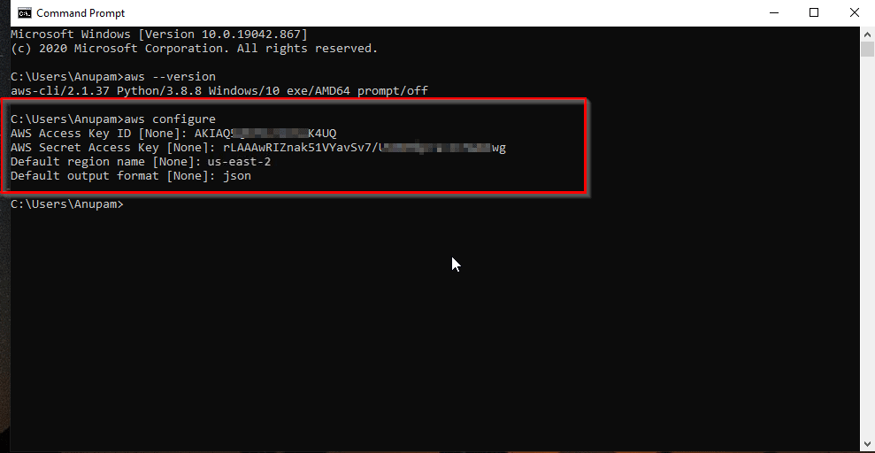

# 운영 DB 연결 테스트


## public 으로 운영 DB 뒀을때&#x20;

**1-4) 운영 DB 연결 테스트**

(1) 백엔드 소스코드 폴더로 이동

* 실습을 위해서는 개발 환경 세팅 (MySQL Workbench, NodeJS, 포스트맨)을 먼저 진행을 해야 합니다.

&#x20;

(2) .env 환경변수 파일에 DB 정보 저장

* 파일 위치 : /.env
* DB 정보 : 1-2) RDS 생성 > (14) DB 생성 완료 후 3가지 정보 확인

<figure><figcaption></figcaption></figure>

* 마스터 사용자 이름 (PROD\_DB\_USERNAME)&#x20;
* 마스터 암호 (PROD\_DB\_PASSWORD)&#x20;
* 엔드포인트 (PROD\_DB\_HOST)
* 데이터베이스 이름  (PROD\_DB\_DATABASE)

&#x20;

(3) 백엔드 production 버전으로 실행

* npm run start&#x20;

<figure><figcaption></figcaption></figure>

&#x20;

(4) 포스트맨으로 회원가입 API 호출

* raw 오디오 버튼에서 JSON 선택이 필요합니다.

<figure><figcaption></figcaption></figure>

&#x20;

(5) MySQL Workbench로 users 테이블에 회원 데이터 저장되었는지 확인

<figure><figcaption></figcaption></figure>


## private 으로 운영 DB 뒀을때


#### Bation 일경우

private 로 DB 를 두게 되면 위와 같은 방식으로 접속이 되지 않는다.

bation 으로 접속하고 나서 포트포워딩을 해줘야한다.

```markdown
Host dev-forward
  User ec2-user
  Hostname 52.230.176.75 -> Public IPv4
  IdentityFile ~/.ssh/test.pem
  LocalForward 5432 test-db-development.cmnlmdidefba.ap-northeast-2.rds.amazonaws.com:5432
```

위와 같이 설정하고나서 터미널에&#x20;

`ssh dev-forward` 이라고 입력하면 된다.

#### SSM 일경우

SSM 으로 연결을 했을경우 우선 aws-cli 셋팅이 필요하다.

AWS 접속 -> IAM -> 사용자 생성 -> Access ID, Access Key 를 발급 받는다.

로컬 터미널로 가서 `aws configure` 를 입력한다.

<figure><figcaption></figcaption></figure>

위와 같이 셋팅하게 된다 우리는 region 이 서울 이니까 서울로 맞춰주기만 하면 된다.

Default region name \[None]: ap-northeast-2

를 입력해주면 된다.&#x20;


cd .ssh -> vi config

```markdown
host dev-i-* dev-mi-*
        ServerAliveInterval 15
        User ec2-user
        IdentityFile ~/.ssh/dev-test.pem
        ProxyCommand sh -c "aws ssm start-session --target $(echo %h|cut -d - -f2-) --document-name AWS-StartSSHSession --parameters 'portNumber=%p'"
        
```

붙여넣기를 해준다.

`aws ec2 describe-instances --query "Reservations[].Instances[].{Instance:InstanceId,State:State.Name,Name:Tags[?Key=='Name']|[0].Value}" --output json`

위의 명령어로 인스턴스 리스트를 가져오도록 한다. 인스턴스 리스트 들이 나오게 된다.

그중에 State : running 으로 돌고있는서버의 <mark style="color:yellow;">`Instace`</mark> 를 복사한다.


이후&#x20;

<mark style="color:yellow;">`ssh i-023d92facsdfewfoi`</mark> 로 접속하면 서버에 접속이되고 , 데이터베이스를 연결하면 된다.

host: localhost

user: db\_username

password: rds 데이터베이스 password
